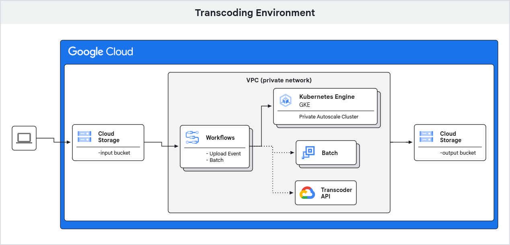
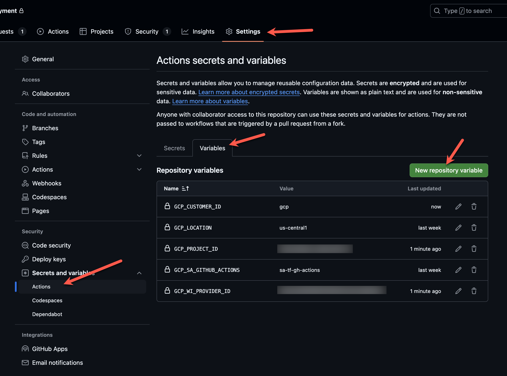
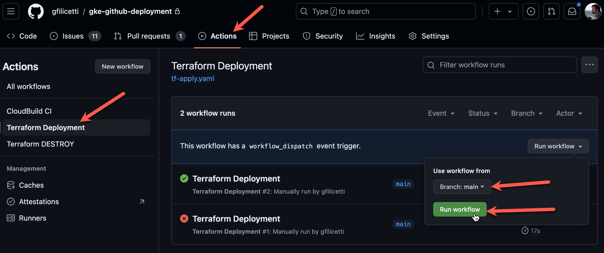

# GKE GitHub Actions Deployment
This repository is a full example of a CI/CD pipeline using GitHub actions,
terraform and other tech to create and deploy workloads to a GKE Autopilot
installation.

##### Table of Contents
**[1. Objectives](#objectives)**

**[2. Tech Used and Prerequisites](#tech-used-and-prerequisites)**

**[3. Workload](#workload)**

**[4. Getting started (Infrastructure Deployment)](#getting-started-infrastructure-deployment)**
* [4.1. (Option 1) Manual deployment with Terraform cli](#option-1-manual-deployment-with-terraform-cli)
* [4.2. (Option 2) Automation setup with GitHub Actions](#option-2-automation-setup-with-github-actions)

**[5. Container Builds](#container-builds)**

**[6. Troubleshooting](#troubleshooting)**



## Objectives
1) Creating a GitHub Actions workflow and deployment strategy for deploying new
Autopilot clusters.

2) Creating a GitHub Actions workflow and deployment strategy for building a
container and deploying it to an Autopilot cluster.

## Tech Used and Prerequisites
- ArgoCD --> TBD
- Artifact Registry
- [gcloud](https://cloud.google.com/sdk/docs/install)
- GitHub Actions
- GKE Autopilot
- Helm charts --> TBD
- [kubectl](https://kubernetes.io/docs/tasks/tools/install-kubectl/)
- [skaffold](https://skaffold.dev/docs/) --> TBD
- [Terraform](https://www.terraform.io/downloads.html)

## Workload
We will be deploying a container image of a customized 'ffmpeg' build to a GKE Autopilot Kubernetes cluster.

> __Note:__ Due to the need for potentially 15k+ nodes, configuration and deployment of multiple Autopilot clusters must be supported.

## Getting started (Infrastructure Deployment)

There are 2 options for deployment:

1) [Option 1](#option-1-manual-deployment-with-terraform-cli): Manually running
through the Terraform deployment with `terraform` cli.

2) [Option 2](#option-2-automation-setup-with-github-actions): Setting up GitHub
Actions and automating deployments on [workflow dispatch](https://docs.github.com/en/actions/managing-workflow-runs-and-deployments/managing-workflow-runs/manually-running-a-workflow)

But first! A few more steps are needed before carrying on to either option 1 or
2.

> __Note:__ Both options assume you already have a new project in Google Cloud
> for which you have IAM permissions to deploy resources into.

Confirm authentication to Google Cloud project and correct project is selected:

```bash
gcloud auth application-default login

gcloud config set project <your-project-id>
```

Set your unique Project ID for Google Cloud:

```bash
export PROJECT_ID=$(gcloud config list --format 'value(core.project)' 2>/dev/null)
```

Set default location for Google Cloud:

```bash
export LOCATION=us-central1
```

To better follow along with this quickstart guide, set `CUR_DIR` env variable:

```bash
export CUR_DIR=$(pwd)
```

Confirm user authentication to Google Cloud project:

```bash
gcloud auth list
```

Check if your authentication is ok and your project id is set:

```bash
gcloud projects describe $PROJECT_ID
```

You should see your `projectId` listed with an `ACTIVE` state.

Finally, enable Google Cloud APIs:

```bash
gcloud services enable --project $PROJECT_ID \
  aiplatform.googleapis.com \
  artifactregistry.googleapis.com \
  batch.googleapis.com \
  cloudbuild.googleapis.com \
  cloudresourcemanager.googleapis.com \
  compute.googleapis.com \
  container.googleapis.com \
  containerfilesystem.googleapis.com \
  containerregistry.googleapis.com \
  eventarc.googleapis.com \
  eventarcpublishing.googleapis.com \
  iam.googleapis.com \
  pubsub.googleapis.com \
  run.googleapis.com \
  servicecontrol.googleapis.com \
  storage.googleapis.com \
  transcoder.googleapis.com \
  workflows.googleapis.com \
  workflowexecutions.googleapis.com
```

### (Option 1) Manual deployment with Terraform cli.

The following steps below will walk you through the setup guide for running
**Terraform** as the deployment process for cloud environment.

#### 1) Clone this git repository

```bash
git clone https://github.com/gfilicetti/gke-github-deployment.git

cd gke-github-deployment
```

#### 2) Create remote state for Terraform in Google Cloud Storage

```bash
sh ./scripts/setup-tfstate.sh
```

#### 3) Set environment variables for unique Terraform variables

```bash
cd $CUR_DIR/terraform

cat terraform.example.tfvars | sed -e "s:your-unique-project-id:$PROJECT_ID:g" > terraform.tfvars
```

#### 4) Deploy infrastructure with Terraform

```bash
terraform init

terraform plan

terraform apply
```

The deployment of cloud resources can take between 5 - 10 minutes. For a detailed view of the resources deployed see [README](terraform/README.md) in `terraform` directory.

#### Project cleanup

In `terraform` directory

```bash
cd $CUR_DIR/terraform

terraform destroy
```

### (Option 2) Automation setup with GitHub Actions

To setup GitHub Actions securely with our Google Cloud environment we will need
to do a one time setup for [Workload Identity federation through a Google Cloud
service account](https://github.com/google-github-actions/auth?tab=readme-ov-file#workload-identity-federation-through-a-service-account).
To assist in this we have 3 scripts that will assist in setup under `./scripts`:

* `./scripts/enable-iam.sh`
* `./scripts/enable-gh-actions.sh`
* `./scripts/setup-tfstate.sh`

#### 1) Create Fork of this repository and clone

Setting up GitHub Actions for automated deployments with Terraform requires the
Google Cloud administrator to create a [fork](https://docs.github.com/en/pull-requests/collaborating-with-pull-requests/working-with-forks/fork-a-repo) of this repo, to personalize variable settings for unique cloud environment.

```bash
git clone https://github.com/<your-cloned-repo-org>/gke-github-deployment.git
```

#### 2) Enable IAM and Google Cloud service APIs for project

```bash
sh ./scripts/enable-iam.sh
```

#### 3) Enable Workload Identity federation with Google Cloud service account

```bash
sh ./scripts/enable-gh-actions.sh
```

Running this will prompt the user with 2 required inputs:

1) The GitHub organization, if repo is forked under personal account this will
most likely be your GitHub username.
2) The name of the GitHub repositry, by default this is set to
`gke-github-deployment`.

Make note of the returned output from running this script to setup GitHub
Actions.

```
----- GITHUB ACTIONS ENV KEY/VALUE -----

GCP_PROJECT_ID: ${PROJECT_ID}
GCP_WI_PROVIDER_ID: ${GCP_WI_PROVIDER_ID}

----------------------------------------
```

#### 4) Setup GitHub Actions in Repository.

With the key/value pair from the previous step. Configure the pair in your
GitHub repository under **Settings > Secrets and variabls > Actions > Variables**



#### 5) Setup Terraform backend to maintain state remotely.

```bash
sh ./scripts/setup-tfstate.sh
```

#### 6) Run workflow

This concludes our one time setup and now all that is left is to run the
workflow. Navigate to **Actions** tab in GitHub. You should notice 2 workflows,
**Terraform Deployment** and **Terraform DESTROY**. The later will clean-up
resources at the end. Click **Terraform Deployment > Run workflow > Branch: main > Run workflow**. To trigger the Terraform deployment process.



#### Project cleanup

Run **Terraform DESTROY** workflow from GitHub Actions page.

## Container builds

This section describes the process for building and pushing containers to
Artifact Registry, where they will later be used to deploy to a container
runtime environment like GKE.

If you setup your environment with GitHub Actions outlined [earlier](#option-2-automation-setup-with-github-actions),
you can simply navigate to the **Actions** table and run **CloudBuild CI**
workflow.

As a second option, navigate to the directory of the container image you are
building:

```bash
cd $CUR_DIR/containers/ffmpeg
```

And manually run the `gcloud` command to build:

```bash
gcloud builds submit --config ./cloudbuild.yaml \
  --region us-central1 \
  --substitutions _PROJECT_ID=$PROJECT_ID
```

## Troubleshooting

#### Not authenticated with Google Cloud project

If you are not running the above project in Google Cloud shell, make sure you are logged in and authenticated with your desired project:

```
gcloud auth application-default login

gcloud config set project <your-unique-project-id>
```

and follow the authentication flow.
