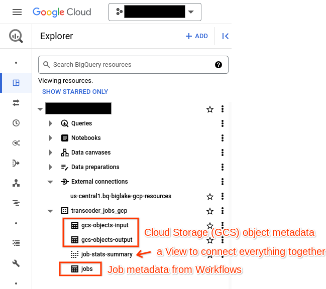
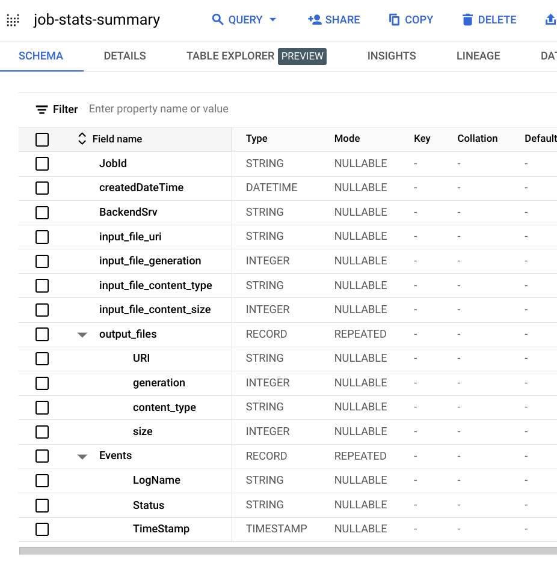
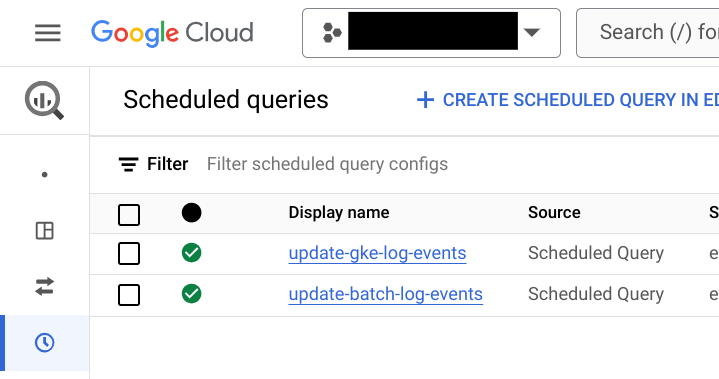
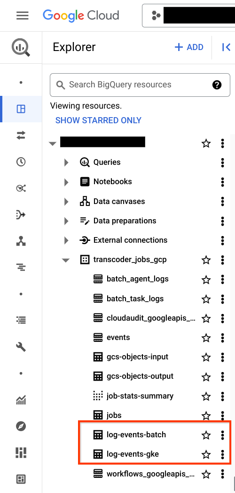

# Analytics of Jobs using BigQuery

> TODO(alanpoole): diagram

# Dataset Overview


The BigQuery dataset includes log extracts, connection to Google Cloud Storage (GCS), Job table(s), and scheduled queries to extract the relavant event information.

## View: Jobs Stats Summary
The `Jobs Stats Summary` View connects the Jobs, GCS `-input` objects, `-output` objects, and other log metadata into a single view to connect all the dots. Including log events pulled in by scheduled queries.



```
SELECT
  `BackendSrv`,
  `Events`.`LogName`,
  `Events`.`Status`,
  `Events`.`TimeStamp`,
  `JobId`,
  `createdDateTime`,
  `input_file_content_size`,
  `input_file_content_type`,
  `input_file_generation`,
  `input_file_uri`
FROM
  `transcoder_jobs_gcp.job-stats-summary`;
```

## Table: Jobs
In [BigQuery](https://console.cloud.google.com/bigquery), the `Jobs` table provides a list of each Transcoding Job uploaded to GCS or initiated by the Workflow. You'll find the [schema here](../analytics/bq-job-stats-schema.json). This is automatically deployed by [terraform](../terraform/bq.tf) and populated by [upload-event](../workflows/upload-event-workflow.yaml) workflow.

## External Object Tables: Google Cloud Storage (GCS) Objects

These BigQuery [Object tables](https://cloud.google.com/bigquery/docs/object-table-introduction) are created automatically by [terraform](../terraform/bq.tf) and are connected using the `bq-biglake-gcp-resources` external connection.

 * `gcs-objects-input` is all objects in the `-input` GCS bucket
 * `gcs-objects-output` is all the objects in the `-output` GCS bucket

## Tables: Logs Sink Exports

Several Log Sinks have been automatically established from Batch Jobs (Compute), Workflow, Kubernetes Engine Events and more. These are defined in the [terraform](../terraform/logs.tf).

* [Log Router](https://console.cloud.google.com/logs/router) -> Log Sink exports:
  1. `events`
  1. `cloudaudit_googleapis_com_activity`
  1. `batch`
  1. `workflows_googleapis_com_executions_system`

## Scheduled Queries

A set of [scheduled queries](https://console.cloud.google.com/bigquery/scheduled-queries) are established to copy relevant log event data and populate a set of `log-events-type` specifc tables.




## Tables: Log Events

A log events table has been automatically created using the [schema](bq-log-events-gke-schema.json). The `Scheduled Queries` populate these tables with relevant event data (started, finished, etc) and timestamp. This is available in the `Jobs Stats Summary` view above.

