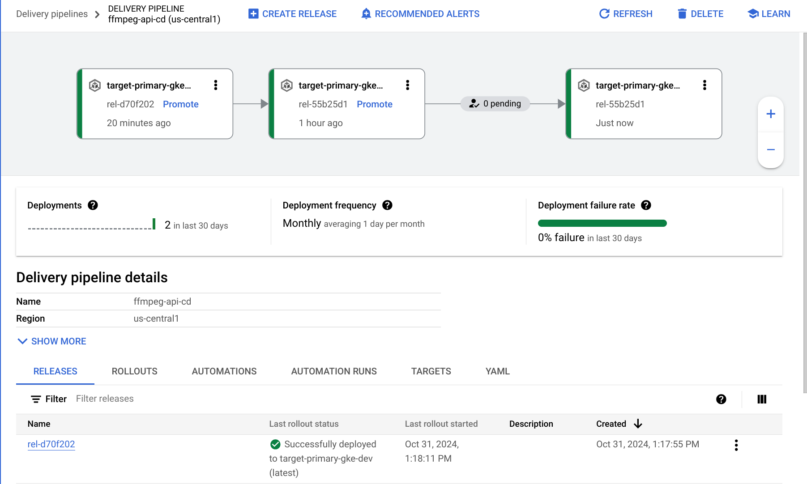

# Container Images

This folder holds source code and Docker configurations for the container images we'll be building and using:
- [ffmpeg](./ffmpeg/README.md)
- [ffmpeg-api](./ffmpeg-api/README.md)

## Building Container Images

This section describes the process for building and pushing container images to Artifact Registry, where they will later be used to deploy to a container runtime environment like GKE.

1. Run this command to invoke Cloud Build to build and push your container image to Artifact Registry

    ```bash
    export APP_NAME=ffmpeg-api
    export COMMIT_SHA7=$(echo $(git rev-parse HEAD) | cut -c1-7)

    gcloud builds submit --config ./containers/$APP_NAME/cloudbuild.yaml \
      --region us-central1 \
      --substitutions _SKAFFOLD_MODULE=$APP_NAME,_RELEASE_ID=$COMMIT_SHA7
    ```

## Deploy Container Images

During the Cloud Build, the last step will deploy the latest container to Google Cloud Deploy. The release is named `rel-$COMMIT_SHA7`

    ```bash
    gcloud deploy releases create rel-${_RELEASE_ID} \
      --region=$LOCATION \
      --delivery-pipeline=$_SKAFFOLD_MODULE-cd \
      --skaffold-version="2.13" \
      --skaffold-file=./containers/$_SKAFFOLD_MODULE/skaffold.yaml \
      --build-artifacts=/workspace/artifacts.json
    ```

On successful completion of Cloud Build, the application will automatically be promoted to the `dev` Target. From there navigate to the Cloud Deploy UI, to manual promot and approve rollouts to `staging` and `prod` Targets.



Cloud Deploy leverages Skaffold for defining how your application might be [rendered](https://skaffold.dev/docs/renderers/) and [deployed](https://skaffold.dev/docs/deployers/). Cloud Deploy pipeline and targets are defined in Terraform while how those applications' kubernetes manifests are rendered and deployed into their respective targets are defined with [Skaffold modules](https://skaffold.dev/docs/design/config/#multiple-configuration-support) and [profiles](https://skaffold.dev/docs/environment/profiles/) in each module.

Not demonstrated in the repository, but Skaffold offers other benefits around the developer lifecycle (developmen and testing) prior to entering a CICD pipeline.
