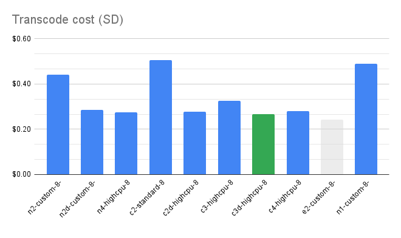
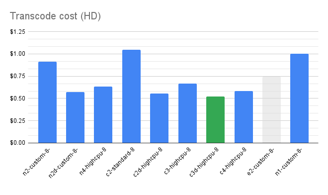
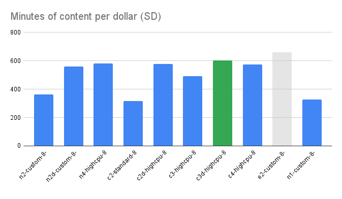
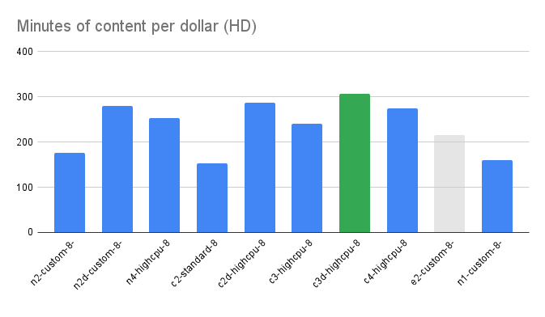

# ffmpeg CPU performance benchmarks

## Objective
Evaluate the transcoding performance between different Google Cloud [machine families](https://cloud.google.com/compute/docs/machine-resource) at both SD and HD resolutions. We measure both raw performance and price/performance metrics. For this set of benchmarks, we are only testing CPU encoding performance, not GPU.

## Machine families
We test across the following machine families, including both Intel and AMD [CPU platforms](https://cloud.google.com/compute/docs/cpu-platforms):

| Machine family | Processor used | Machine shape |
| -------------- | -------------- | ------------- |
[N2](https://cloud.google.com/compute/docs/general-purpose-machines#n2_series) | Intel Cascade Lake | n2-custom-8-16384[^1]
[N2D](https://cloud.google.com/compute/docs/general-purpose-machines#n2d_machines) | AMD EPYC Milan | n2d-custom-8-163841[^1]
[N4](https://cloud.google.com/compute/docs/general-purpose-machines#n4_series) | Intel Emerald Rapids | n4-highcpu-8
[C2](https://cloud.google.com/compute/docs/compute-optimized-machines#c2_series) | Intel Cascade Lake | c2-standard-8[^2]
[C2D](https://cloud.google.com/compute/docs/compute-optimized-machines#c2d_series) | AMD EPYC Milan | c2d-highcpu-8
[C3](https://cloud.google.com/compute/docs/general-purpose-machines#c3_series) | Intel Sapphire Rapids | c3-highcpu-8
[C3D](https://cloud.google.com/compute/docs/general-purpose-machines#c3d_series) | AMD EPYC Genoa | c3d-highcpu-8
[C4](https://cloud.google.com/compute/docs/general-purpose-machines#c4_series) | Intel Emerald Rapids | c4-highcpu-8
[E2](https://cloud.google.com/compute/docs/general-purpose-machines#e2_machine_types) | Intel Broadwell (HD), AMD Rome (SD)[^3] | e2-custom-8-163841[^1]
[N1](https://cloud.google.com/compute/docs/general-purpose-machines#n1_machines) | Intel Haswell | custom-8-163841[^1]


### Machine shapes

For performance and price comparisons, we test on VMs with 8 vCPUs and 16 GB of RAM. For most machine families, this is a predefined shape of `xx-highcpu-8`. For others, we need to define a custom configuration.

## Resolutions

For the purposes of this test, we work with the following resolutions:

| Source | Resolution | Other names |
| ------ | ---------- | ----------- |
Raw (source video) | 3840x2160 | 2160p, 4k
SD | 854x480 | 480p, Standard Definition
HD | 1920x1080 | 1080p, High Definition

## Video source asset

We use the open source animation project [Big Buck Bunny](https://peach.blender.org/) (sponsored by Blender). This project is widely used as test footage in many content creation industries. The highest resolution available is 4k. The duration of the video is ~12 minutes. The original download can be found [here](https://download.blender.org/demo/movies/BBB/) (2160p, 30fps, mp4).

To test a long-format transcode, we generated a 160-minute version of the original by looping the video multiple times, written to a single file. We then performed transcoding benchmarks on this video to both HD and SD resolutions.

## Testing methodology

We're using the same testing framework built for the blog post [Benchmarking Rendering Software](https://cloud.google.com/blog/topics/developers-practitioners/benchmarking-rendering-software-compute-engine) (GitHub repo [here](https://github.com/adrian-a-graham/benchmarking-rendering-software)). This framework performs the following:

1. Run bash script from a local terminal to generate VMs based on a config file.

    ```
    bin/run_benchmark_ffmpeg.sh \
      --config [CONFIG_FILE] \
      --benchmark [BENCHMARK] \
      --resolution [RESOLUTION] \
      [--verbose|--noop]
    ```
    This will create one VM per line in `[CONFIG_FILE]` with a startup script for the specified `[BENCHMARK]`.

2. The startup script downloads the benchmark script. This script is self-launching, and draws variables from the VM metadata:

    | Key | Value |
    | --- | ----- |
    `startup-script-url` | `gs://path/to/script/[BENCHMARK]-[OS]-startup.sh`
    session | `[BENCHMARK]-[DATE]-[RESOLUTION]`
    delete | Boolean, whether to delete the VM on benchmark completion. Default=True
    resolution | 'sd' or 'hd'

3. The benchmark script runs and performs the following:
    1. Install `ffmpeg` and supporting libraries.
    1. Download source video file to transcode.
    1. Run `ffmpeg` command, looping 4 times, recording each duration.
        1. The first iteration is discarded to ensure disk caching performance isn't factored into the overall calculation.
    1. An average duration is calculated from the remaining 5 runs.
    1. Metrics are written locally and pushed to a Google Cloud Storage bucket in JSON format.

## ffmpeg command

We transcoded the source video using the ffmpeg configuration:

```
ffmpeg \
    -i [SOURCE_VIDEO] \
    -report \
    -c:v libx264 \
    -filter:v scale="-2:[RESOLUTION]" \
    -preset:v medium \
    -x264-params "keyint=120:min-keyint=120:sliced-threads=0:scenecut=0:asm=${_ASM}" \
    -tune psnr -profile:v high -b:v 6M -maxrate 12M -bufsize 24M \
    -c:a copy \
    -y \
    [OUTPUT_FILE].mp4
```

Where:
- `[SOURCE_VIDEO]` is the path to the source video.
- `[RESOLUTION]` is either "480" or "1080".
- `[_ASM]` is queried at runtime to determine whether the CPU platform is compatible with the "avx512" instruction set. If not, the value will default to "avx2".
- `[OUTPUT_FILE]` is the output path to the final transcoded file.

## Testing results

Cost comparison breakdowns are displayed on the charts below, which multiplies:

1. The cost of the VM per hour (which varies depending on machine type and shape).
1. The length of time to transcode the 160-minute 4k video.

This can be expressed as:

`transcode cost = cost of VM per hour * transcode duration`




## The E2 machine type

The performance of this particular machine family tends to be less predictable due to the wide variety of CPU platforms an E2 VM may be provisioned with. When an E2 VM is created, it may be assigned[^4] any one of five CPU platforms: Intel Skylake, Broadwell, or Haswell, AMD EPYC Rome or EPYC Milan.

Case in point: the HD and SD benchmarks for the E2 machine family were run on two different VMs. The VM running the SD benchmark was created with an AMD EPYC Rome CPU, the HD benchmark with an Intel Haswell CPU. This is evident in the performance differences between the HD and SD benchmarks for the E2 machine type.

## Minutes per dollar

It's worth examining the resulting blended value of each machine family based on transcode performance expressed as _minutes of content per dollar._ This may be a helpful metric to compare different CPU or GPU platforms as it provides a single number based on VM performance, VM cost, transcode duration and complexity.

We can chart these metrics by simply dividing the duration of the video to transcode (in minutes) by the cost to perform that particular transcode:

`minutes/dollar = video duration / cost to perform transcode`

In the charts below, we gray out the E2 machine type as its performance can be unpredictable based on which CPU the VM is provisioned with:




The C3D can consistently transcode the highest number of video minutes per dollar of all the machine families.

## Recommendations

Although some transcodes complete faster than others, the VM's per-hour costs can be higher, which may negate the time saved of the transcode.

If lowest cost is the highest priority, the **E2 machine** family may be the best option. If you need predictable performance, however, the E2 machine family may not be ideal.

If you remove the E2 from the benchmark comparisons, the **C3D machine type** with the AMD EPYC Genoa CPU consistently exhibits the best price/performance.

The C3D's better performance may be due to the 4th generation AMD EPYC Genoa CPU being both lower cost, higher high clock speed, and possibly better implementation of AVX-512 (according to some online resources). These technical differences are beyond the scope of this document.

[^1]: For these machine families, there is no matching preconfigured shape, so we use a custom shape.
[^2]: For C2 machine shapes, this configuration is unavailable, and custom shapes aren't allowed, so we use c2-standard-8, which has 8 vCPUs and 32 GB RAM.
[^3]: These were the particular CPU platforms automatically assigned during provisioning, see [note](#the-e2-machine-type).
[^4]: A full list of machine families and their associated CPU platforms can be found here.
