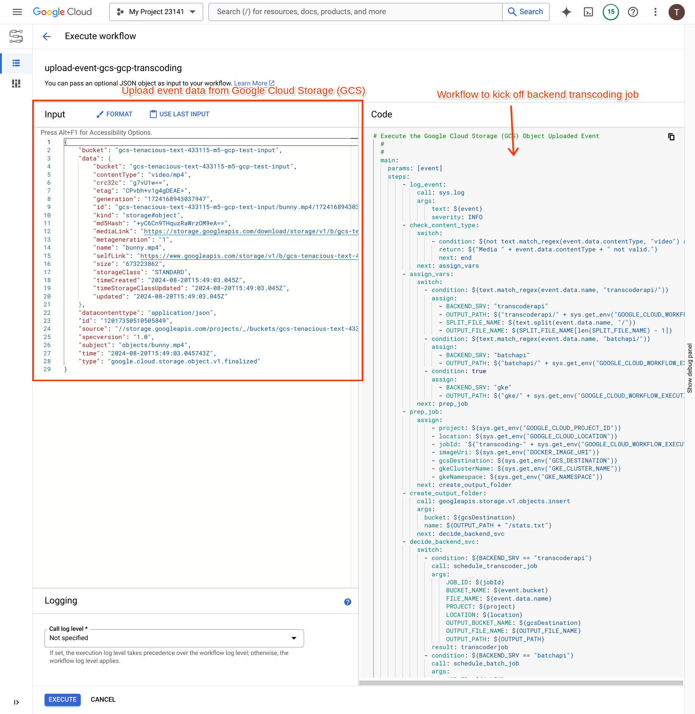
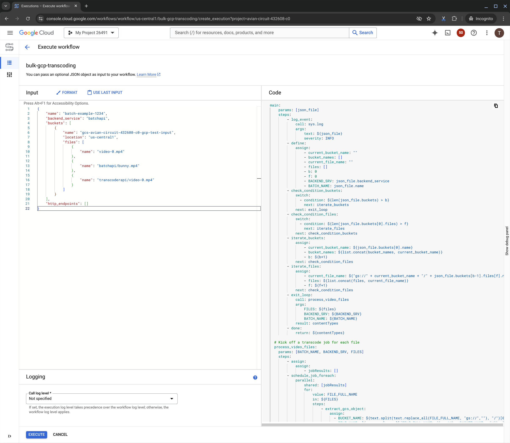

# Deploy Managed Workflows

It is common to use a [Managed Workflow](https://cloud.google.com/workflows/docs) to connect newly uploaded video files, in [Google Cloud Storage](https://cloud.google.com/storage/docs) (GCS) as an example, to the most appropriate backend transcoding service: [Transcoder API](https://cloud.google.com/transcoder/docs), [Batch Compute API](https://cloud.google.com/batch/docs), and a [Kubernetes Engine kueue](https://cloud.google.com/kubernetes-engine/docs/tutorials/kueue-intro).

By default, the `Upload Event` workflow listens to a new video file being uploaded to the `-upload` GCS bucket and subscribes to an [EventArc](https://cloud.google.com/eventarc/docs) event. It then processes the upload event, decides which backend to send the video to, and calls that appropriate backend. By default, the newly uploaded video files are sent to [Google Kubernetes Engine](https://cloud.google.com/kubernetes-engine/docs/tutorials/kueue-intro) (GKE).

Additionally, a `Bulk Upload` workflow can be used to define a batch of videos to process and kick off a transcoding job for each.

> TODO: diagram Upload a file to -input GCS bucket -> eventarc -> workflow -> {api, batch, k8s} -> -output gcs bucket

## Workflows UI

Open the https://console.cloud.google.com/workflows UI in the appropriate GCP project.

## Upload Event Workflow

The `Upload Event` is automatically called when a new video file is uploaded to the `-input` Google Cloud Storage (GCS) bucket. Event data, such as video metadata, is sent from GCS to the Workflow as an input.



### Workflow Steps:
1. `check_content_type`: verify that the event file contentType is a `video`, end the workflow and ignore the rest (such as creating a new folder in the `-input` bucket).
1. `assign_vars` and `prep_job` are preperation for follow-on steps.
1. `create_output_folder` creates an output folder in the `-output` GCS bucket.
    * Format: `-output/backendsrv/jobid`
1. `decide_backend_svc` logic:
    * **By default, send video files to `GKE` as a Job**
    * If the event has a `backend_service` parameter defined, us it. (defined in the bulk upload json spec)
    * If the uploaded file has `transcoderapi/`, send it to the [Transcoder API](https://cloud.google.com/transcoder/docs). Create a `transcoderapi` folder in the `-input` GCS bucket.
    * If the uploaded file has `batchapi/`, send it to the [Batch Compute API](https://cloud.google.com/batch/docs). Create a directory called `batchapi` in the `-input` GCS bucket.
1. `finish_workflow`

### Backends:
1. [Default] `schedule_k8s_job` kicks off a Kubernetes Job by calling [gke.create_job](https://cloud.google.com/workflows/docs/reference/connectors/gke/create_job)
1. `schedule_batch_job` kicks off a Compute Engine Batch API job by calling [googleapis.batch.v1.projects.locations.jobs.create](https://cloud.google.com/workflows/docs/reference/googleapis/batch/v1/projects.locations.jobs/create)
1. `schedule_transcoder_job` kicks off a Transcoder API job by calling [googleapis.transcoder.v1.projects.locations.jobs.create](https://cloud.google.com/workflows/docs/reference/googleapis/transcoder/v1/projects.locations.jobs/create)

### Environmental Variables

By default, the [Terraform](../terraform/workflow.tf) is configured with the following environmental variables:

```
    DOCKER_IMAGE_URI        = URI of container image
    GCS_DESTINATION         = output GCS Bucket
    MACHINE_CPU_MILLI       = "16000"
    MACHINE_MEMORY_MIB      = "65536"
    MACHINE_TYPE            = "c2-standard-16"
    GKE_CLUSTER_NAME        = The name of the GKE Cluster
    GKE_NAMESPACE           = The namespace for Jobs to be submitted to GKE
    VPC_NETWORK_FULLNAME    = Default VPC Network
    VPC_SUBNETWORK_FULLNAME = Default subnet
```

### Resources

For each Kubernetes Job created, the Kueue Job namespace and resources are defined in the [upload-event-workflow.yaml](../workflows/upload-event-workflow.yaml) and deployed via [Terraform](../terraform/workflow.tf). The `queue-name` can be changed and configured, as per [examples](../examples/kueue/README.md). The `requested resources` can be changed, by default they are large: 16 vCPUs and 64 Gi of memory for each container.

```
                metadata:
                  name: "${JOB_ID}"
                  namespace: ${GKE_NAMESPACE}
                  annotations:
                    kueue.x-k8s.io/queue-name: lq-team-b
                    # kueue.x-k8s.io/priority-class: high-priority
```

```
                        resources:
                            requests:
                                cpu: 16
                                memory: 64Gi
```

`MACHINE_TYPE` can be defined for the Batch API requests.

### Container variables & GCSFuse

For the Kubernetes Job and Batch API, [GCSFuse](https://cloud.google.com/kubernetes-engine/docs/how-to/persistent-volumes/cloud-storage-fuse-csi-driver) is used to mount the GCS `-input` bucket as `/input` and the GCS `-output/srv/id` folder as `/output`. The [ffmpeg container](../containers/ffmpeg/README.md) reads from `/input` and writes to `/output`.

The Workflow passes `MEDIA` and `OUTPUT_PATH` to the [ffmpeg container](../containers/ffmpeg/README.md). It reads the input video from `/input/videoname.mp4` (`--MEDIA=videoname.mp4`).

## Bulk Workflow

Use the `bulk--transcoding` workflow to define a list of video files and kick off the above workflow for each. As an example, view the [batch-example.yson](batch-example.json) file.

For each valid file, the `Upload Event` workflow is kicked off to create the appropriate Job.



```
{
    "name": "batch-example-1234",
    "backend_service": "gke",
    "buckets": [
        {
            "name": "my-bucket-input",
            "location": "us-central1",
            "files": [
                {
                    "name": "bunny.mp4"
                },
                {
                    "name": "bunny.mp4"
                },
                {
                    "name": "bunny.mp4"
                }
            ]
        }
    ],
    "http_endpoints": []
}
```

## References

*Extends this [EventArc guide](https://cloud.google.com/eventarc/docs/workflows/route-trigger-cloud-storage).*